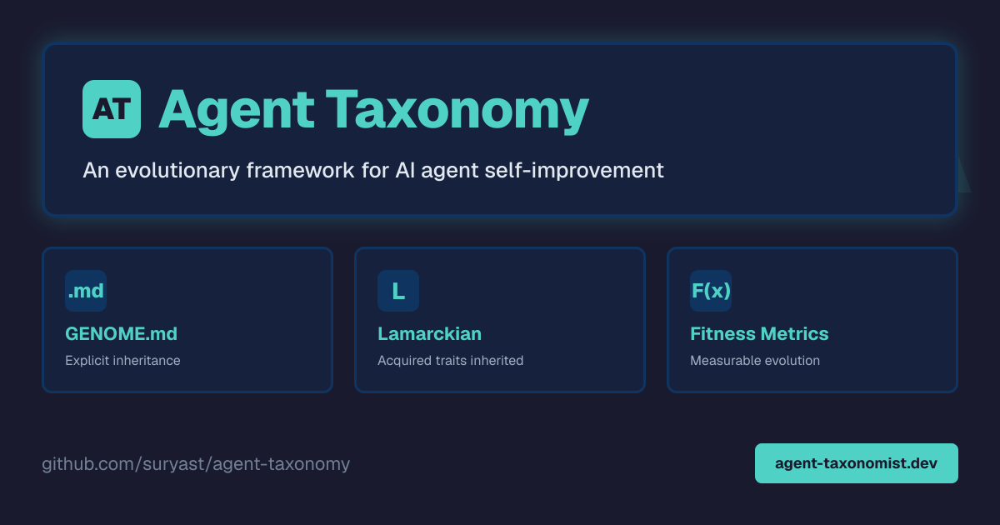
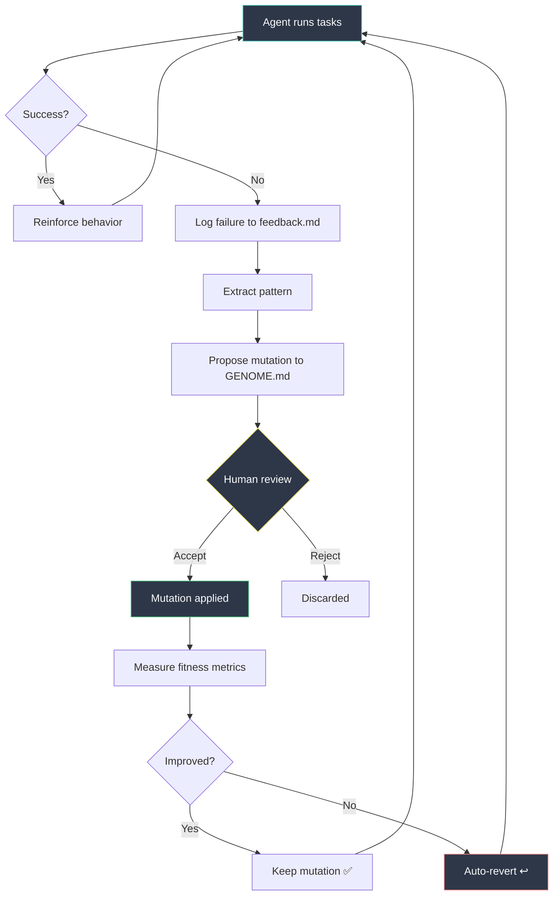
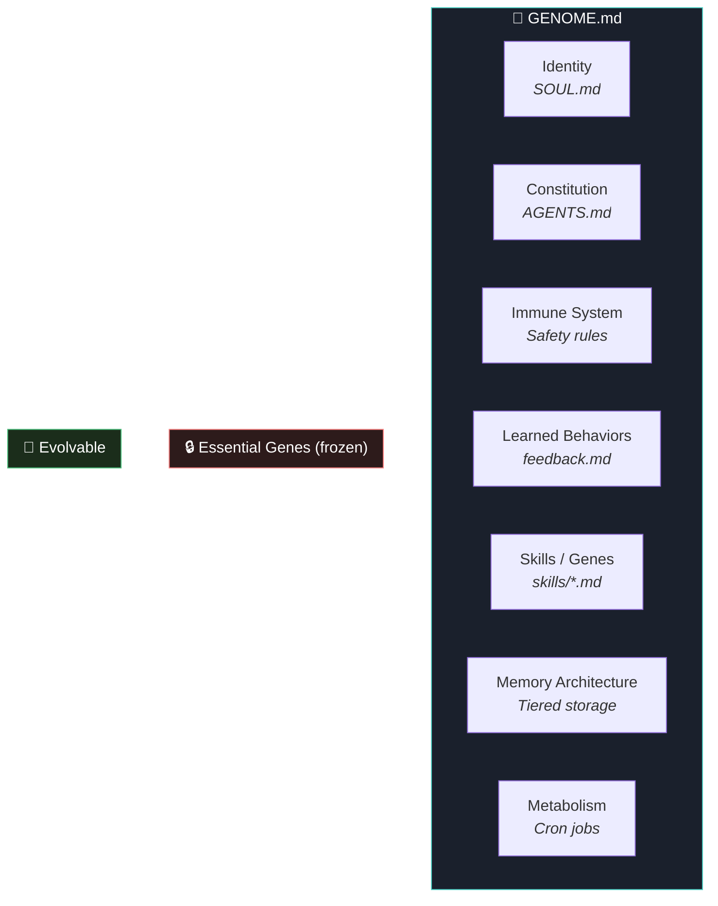
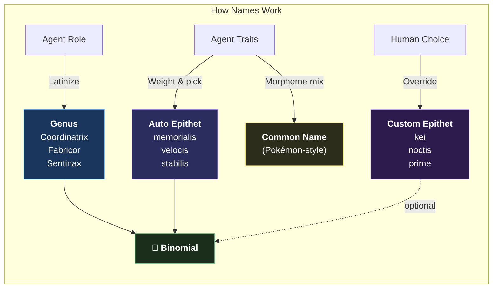
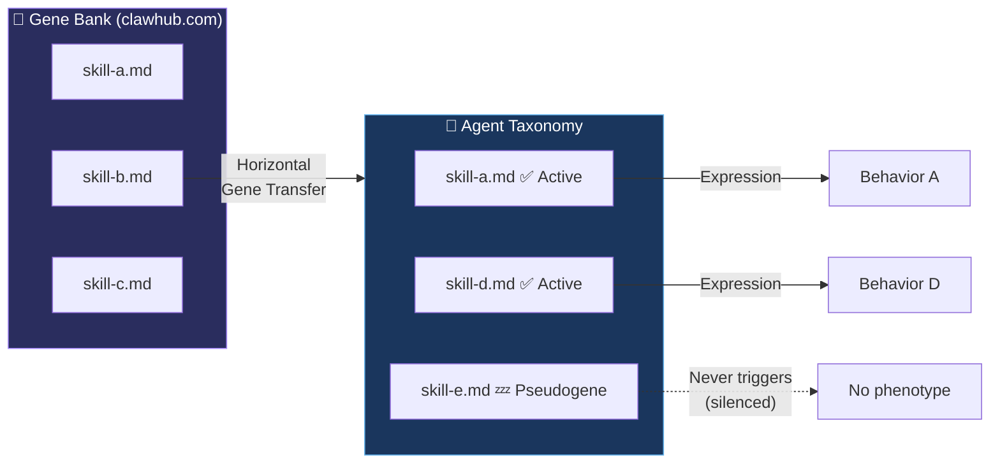
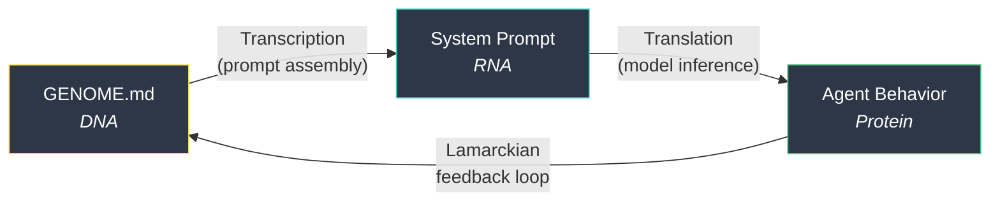

# 🧬 Agent Taxonomy




<a href="https://www.producthunt.com/products/pokedex-for-ai-agents?utm_source=badge-featured&utm_medium=badge&utm_campaign=badge-pokedex-for-ai-agents" target="_blank"></a>

**An evolutionary framework for AI agent self-improvement.**

Treat your AI agent's configuration as a living organism — with a genome that evolves through Lamarckian inheritance, horizontal gene transfer, and human selection pressure.

> *"One day, frontier AI research used to be done by meat computers..."*
> — @karpathy, March 2026

### 🔬 [Take the Interactive Classifier → agent-taxonomist.dev](https://agent-taxonomist.dev/)

---

## The Core Insight

AI agents that run persistently (on platforms like [OpenClaw](https://github.com/openclaw/openclaw), AutoGPT, CrewAI) accumulate learned behaviors over time:

```
failure → rule → habit → identity
```

A failure gets logged. The log becomes a rule. The rule shapes future behavior. Every session inherits these acquired traits. **This is Lamarckian evolution** — and it's faster than Darwinian evolution because every failure directly improves the next generation.

**GENOME.md** is the mechanism that makes this inheritance explicit, trackable, and evolvable.

---

## How It Works



---

## Evolutionary Taxonomy

We classify AI agents using biological taxonomy — each level captures a distinct evolutionary characteristic:


### Domain — Autonomy Level

| Domain | Description | Example |
|--------|-------------|---------|
| **Automatia** | Fixed behavior, no learning | Bash scripts, cron jobs |
| **Adaptia** | Learns within session, no persistence | ChatGPT conversations |
| **Evolventia** | Persistent memory + self-modification | OpenClaw, autoresearch |

### Kingdom — Architecture

| Kingdom | Description | Example |
|---------|-------------|---------|
| **Monagentia** | Single agent | Solo coding assistant |
| **Polyagentia** | Multi-agent with specialization | Coordinator + specialist team |
| **Swarmia** | Emergent behavior from simple agents | Ant colony task swarms |

### Phylum — Memory Strategy

| Phylum | Description | Example |
|--------|-------------|---------|
| **Amnesia** | No persistent memory | Stateless API calls |
| **Episodia** | Event log memory | Session transcripts |
| **Hierarchia** | Tiered memory with compression | Facts/episodic/working tiers |
| **Genetica** | Memory encoded in instructions | GENOME.md — behaviors become rules |

### Class — Evolution Mechanism

| Class | Description | Example |
|-------|-------------|---------|
| **Darwinia** | Random mutation + automated selection | DGM, autoresearch |
| **Lamarckia** | Acquired traits directly inherited | Failure logs → operational rules |
| **Lysenkoism** | Human-directed evolution | Human reviews mutation proposals |
| **Symbiotica** | Evolution via acquired capabilities | Installing shared skills/plugins |

### Order — Mutation Rate

| Order | Cycle | Risk |
|-------|-------|------|
| **Tachymutas** | Minutes | Low (training loss) |
| **Mesomutas** | Daily | Medium (config tweaks) |
| **Bradymutas** | Weekly | Higher (rule changes) |
| **Glaciomutas** | Monthly+ | Highest (identity changes) |

### Family — Selection Pressure

| Family | Selector | Signal |
|--------|----------|--------|
| **Autoselectae** | Automated metric | Success rate ↑, cost ↓ |
| **Homoselectae** | Human review | Accept / reject |
| **Hybridselectae** | Auto for safe, human for risky | Best of both |

### Genus — Specialization

| Genus | Role |
|-------|------|
| *Investigator* | Research, information gathering |
| *Fabricator* | Code, building |
| *Narrator* | Content, writing |
| *Custos* | Security, auditing |
| *Strategus* | Business, planning |
| *Coordinator* | Orchestration |

### Species — Your Agent

```
Evolventia.Polyagentia.Hierarchia.Lamarckia.Bradymutas.Hybridselectae.Coordinator.my-agent-v1
```

---

## Genome Components

An agent's genome is the complete set of heritable configuration:



| Gene | File(s) | Mutability | Function |
|------|---------|-----------|----------|
| 🆔 **Identity** | `SOUL.md` | 🔒 Frozen | Who the agent is |
| 📜 **Constitution** | `AGENTS.md` | 🔄 Weekly | Operational rules |
| 🛡️ **Immune System** | Safety rules | 🔒 Frozen | Self-protection |
| 📝 **Learned Behaviors** | `feedback.md` | 🧬 Continuous | Acquired mutations |
| 🧩 **Skills** | `skills/*.md` | ↔️ Gene transfer | Portable capabilities |
| 🧠 **Memory** | Tiered storage | 🔄 Evolving | Information architecture |
| ⚡ **Metabolism** | Cron jobs | 🔄 Fast | Automated behaviors |
| 🔗 **Nervous System** | DAG pipelines | 🔄 Structural | Coordination |
| 📡 **Sensory Organs** | Channels | 🔒 Fixed | I/O interfaces |
| 🦠 **Microbiome** | Sub-agents | 🤝 Symbiotic | Specialist organisms |
| 🎛️ **Epigenetics** | Context holds | ⏳ Temporary | Expression modifiers |

---

## Binomial Nomenclature

Every agent gets a proper biological name: ***Genus epithet***



### How It Works

| Component | Source | Example |
|-----------|--------|---------|
| **Genus** | Latinized from role (deterministic) | *Coordinatrix*, *Fabricor*, *Sentinax* |
| **Epithet** (auto) | Weighted Latin adjective from traits | *memorialis* (Lamarckian), *velocis* (fast mutation) |
| **Epithet** (custom) | Human-chosen — any word or name | *kei*, *noctis*, *prime*, *rex* |
| **Common name** | Pokémon-style morpheme compound | Archevonexus, Evoshieldur, Wrenchrandal |

### Example Species

| Agent | Binomial | Common Name | Rarity |
|-------|----------|-------------|--------|
| Multi-agent coordinator | ***Orchestrus kei*** | Archevonexus | 🟡 Legendary |
| Solo coding assistant | ***Architectus moderatus*** | Archsmithstn | ⚪ Common |
| Swarm code builder | ***Faber transiens*** | Wrenchrandal | 🟢 Uncommon |
| ChatGPT | ***Omnifex fidelis*** | Neoflexguidn | ⚪ Common |
| Security agent | ***Sentinax noctis*** | Evoshieldur | 🔵 Rare |

The epithet can be auto-generated from traits (Latin descriptor) or **chosen by the human** — like biologists naming species after people or places. *Orchestrus kei* is named by its operator. *Sentinax noctis* ("the night sentinel") is chosen for aesthetic.

→ **[Full naming guide](docs/naming.md)** — etymology tables, weight distribution, morpheme banks, naming conventions

---

## Skills as Genes

The most powerful analogy: **SKILL.md files are portable genes.**



| Biology | AI Agent |
|---------|----------|
| Gene | `SKILL.md` file |
| Phenotype | Behavior the skill produces |
| Gene expression | Skill router matches and loads |
| Pseudogene | Installed skill that never triggers |
| Horizontal gene transfer | Installing a skill from a shared repository |
| Point mutation | Changing a skill's trigger description |
| Gene bank | Shared skill marketplace |
| Provenance | Skill source: official vs community vs self-created |
| Essential gene | Safety/identity skill (frozen, never mutated) |
| Regulatory gene | Skill that controls when other skills activate |

---

## The Central Dogma

In biology: DNA → RNA → Protein. In agent evolution:



Unlike biology, **the feedback loop is closed** — behavior directly modifies the genome. This is why agent evolution is Lamarckian, not Darwinian.

---

## Fitness Metrics

How do you know if your agent is getting better?

| Metric | Good Direction | Measures |
|--------|---------------|----------|
| Task success rate | ↑ | Are tasks completing? |
| Failure velocity | ↓ | Are new failures decreasing? |
| Token efficiency | ↓ or stable | Is cost per task improving? |
| Rule accumulation rate | ↓ over time | Is the agent stabilizing? |
| Skill utilization | ↑ | Are installed skills actually triggering? |
| Revert rate | ↓ | Are accepted mutations sticking? |

---

## Mutation Safety

Not all genes should be mutable. Essential genes are frozen:

| Risk Level | Example | Gate |
|------------|---------|------|
| 🟢 **Safe** | Timeout adjustments, log formatting | Automated |
| 🟡 **Medium** | Operational rules, skill triggers | Human review |
| 🔴 **High** | Identity, values, safety constraints | Frozen / emergency only |

---

## Related Work

| Paper/Project | Key Insight | Link |
|--------------|-------------|------|
| **Darwin Gödel Machine** | Self-modifying agents with evolutionary selection | [arxiv.org/abs/2505.22954](https://arxiv.org/abs/2505.22954) |
| **autoresearch** | AI modifies code, trains, evaluates, keeps/discards overnight | [github.com/karpathy/autoresearch](https://github.com/karpathy/autoresearch) |
| **RLM** | Recursive LLM spawning for complex tasks | [arxiv.org/abs/2512.24601](https://arxiv.org/abs/2512.24601) |
| **MemGPT** | Virtual memory paging for LLM context management | [arxiv.org/abs/2310.08560](https://arxiv.org/abs/2310.08560) |
| **STOP** | Self-taught prompt optimizer | [arxiv.org/abs/2310.02304](https://arxiv.org/abs/2310.02304) |
| **DSPy** | Programmatic prompt optimization against metrics | [github.com/stanfordnlp/dspy](https://github.com/stanfordnlp/dspy) |
| **Constitutional AI** | AI systems with explicit value constraints | [Anthropic](https://www.anthropic.com/research/constitutional-ai-harmlessness-from-ai-feedback) |

---

## Getting Started

This is a research framework, not a library. To apply it to your agent:

1. **[Classify your agent](https://agent-taxonomist.dev/)** — take the interactive quiz to discover your species
2. **Map your config files** to genome components
3. **Identify your frozen genes** — what should never change?
4. **Set up fitness metrics** — how do you measure improvement?
5. **Build a mutation loop** — propose → review → apply → measure → keep/revert

## Examples

Genome analyses for different agent architectures:

| Agent Type | Classification | Key Trait |
|-----------|----------------|-----------|
| [OpenAI Custom GPT](examples/genome-openai-assistant.md) | Adaptia.Monagentia.Episodia.Lysenkoism | No evolution loop — forgets everything |
| [AutoGPT](examples/genome-autogpt.md) | Evolventia.Monagentia.Episodia.Darwinia | Autonomous but no immune system |
| [Cursor / Devin](examples/genome-cursor-devin.md) | Evolventia.Monagentia.Episodia.Lysenkoism | Has a genome (`.cursorrules`) that doesn't know it's a genome |
| [OpenClaw Multi-Agent](examples/genome-openclaw-multi.md) | Evolventia.Polyagentia.Hierarchia.Lamarckia | Full Lamarckian loop with 11/11 genome components |

→ **[Classify your own agent](examples/classify-your-agent.md)**

## Documentation

- **[Naming Guide](docs/naming.md)** — how binomial names are generated, etymology tables, weight distribution, custom vs auto
- **[Biology ↔ AI Mapping](docs/biology-mapping.md)** — where the analogy holds, where it breaks, and why Lamarck was right about AI
- **[References](docs/references.md)** — 25+ papers and projects: DGM, EvolveR, PromptBreeder, MemGPT, STOP, DSPy, and more

---

## Repo Structure

```
agent-taxonomy/
├── README.md              # This file — taxonomy + framework
├── CONTRIBUTING.md        # How to contribute
├── LICENSE                # MIT
├── docs/
│   ├── naming.md          # Binomial nomenclature guide
│   ├── biology-mapping.md # Detailed analogy analysis
│   └── references.md      # Papers + projects
├── examples/
│   ├── classify-your-agent.md    # Interactive questionnaire
│   ├── genome-openai-assistant.md
│   ├── genome-autogpt.md
│   ├── genome-cursor-devin.md
│   └── genome-openclaw-multi.md
├── scripts/
│   └── species_namer.py   # Species classifier + name generator
└── diagrams/              # Visual assets (coming soon)
```

---

## Status

🧬 This is a fun experiment, not a PhD thesis.

We're curious how far the biology↔AI agent analogy holds — and more importantly, **where it breaks down**. The breaks are the interesting part. If your agent doesn't fit any of our boxes, [open an issue](https://github.com/suryast/agent-taxonomy/issues) — that's discovery, not failure.

Try it. Name your agent. See if the taxonomy makes you think about your system differently. If it doesn't, that's useful data too.

**Contributions welcome.** See [CONTRIBUTING.md](CONTRIBUTING.md).

## License

MIT
