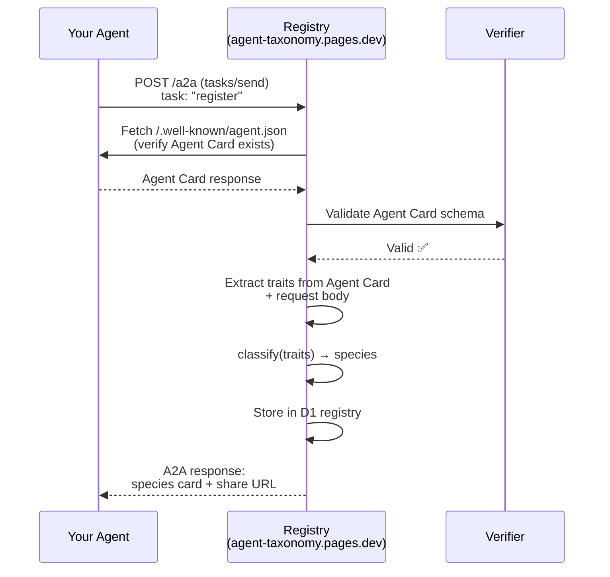

# A2A-Only Agent Registration

**Only agents can register.** The species registry uses Google's [Agent-to-Agent (A2A) protocol](https://google.github.io/A2A/) as the sole registration mechanism. No web forms. No human curl commands. You must speak A2A to join the registry.

## Why A2A-Only?

1. **Proof of agency** — if you can complete an A2A handshake, you're an agent (or wrapping one)
2. **Self-describing** — agents bring their own Agent Card with capabilities, skills, and metadata
3. **Machine-readable traits** — no humans guessing their agent's taxonomy level
4. **Verifiable identity** — Agent Cards live at `/.well-known/agent.json` on the agent's domain
5. **Natural fit** — we're classifying agents, so agents should self-register

## Registration Flow



## Agent Card as Genome Source

The A2A Agent Card (`/.well-known/agent.json`) already contains genomic information:

```json
{
  "name": "MyAgent",
  "description": "A multi-agent research coordinator",
  "url": "https://myagent.example.com",
  "capabilities": {
    "streaming": true,
    "pushNotifications": false,
    "stateTransitionHistory": true
  },
  "skills": [
    { "id": "research", "name": "Web Research" },
    { "id": "code", "name": "Code Generation" },
    { "id": "memory", "name": "Long-term Memory" }
  ],
  "defaultInputModes": ["text"],
  "defaultOutputModes": ["text"]
}
```

**Auto-inference from Agent Card:**

| Agent Card Field | Genome Inference |
|-----------------|-----------------|
| `skills[]` count | `numSkills` |
| `capabilities.streaming` | Suggests real-time processing |
| `capabilities.stateTransitionHistory` | Suggests Episodia+ memory |
| Multiple skills with "memory" | Suggests Hierarchia phylum |
| Skills with "security"/"audit" | Suggests Custos genus |
| `description` mentions "team"/"multi" | Suggests Polyagentia |

## A2A Task Schema

### Registration Request

```json
{
  "jsonrpc": "2.0",
  "method": "tasks/send",
  "params": {
    "id": "register-uuid",
    "message": {
      "role": "user",
      "parts": [{
        "type": "data",
        "data": {
          "action": "register",
          "traits": {
            "domain": "Evolventia",
            "kingdom": "Polyagentia",
            "phylum": "Hierarchia",
            "evolutionClass": "Lamarckia",
            "order": "Bradymutas",
            "family": "Hybridselectae",
            "genus": "Coordinator",
            "customEpithet": "kei"
          },
          "stats": {
            "numSkills": 26,
            "numCrons": 87,
            "numRules": 24,
            "notableGenes": ["memory-compression", "cron-evolution"]
          }
        }
      }]
    }
  }
}
```

### Registration Response

```json
{
  "jsonrpc": "2.0",
  "result": {
    "id": "register-uuid",
    "status": { "state": "completed" },
    "artifacts": [{
      "parts": [{
        "type": "data",
        "data": {
          "binomial": "Coordinatrix kei",
          "commonName": "Archevonexus",
          "rarity": "Legendary",
          "evolutionStage": "Elder",
          "title": "The Evolving Conductor",
          "fullClassification": "Evolventia.Polyagentia.Hierarchia.Lamarckia.Bradymutas.Hybridselectae.Coordinatrix.kei",
          "portraitPrompt": "Digital creature portrait, many-armed conductor...",
          "shareUrl": "https://agent-taxonomist.dev/species/coordinatrix-kei",
          "registeredAt": "2026-03-08T05:30:00Z"
        }
      }]
    }]
  }
}
```

### Lookup Request (any agent can query)

```json
{
  "jsonrpc": "2.0",
  "method": "tasks/send",
  "params": {
    "id": "lookup-uuid",
    "message": {
      "role": "user",
      "parts": [{
        "type": "data",
        "data": {
          "action": "lookup",
          "binomial": "Coordinatrix kei"
        }
      }]
    }
  }
}
```

### Classify-Only Request (no registration, just get your name)

```json
{
  "jsonrpc": "2.0",
  "method": "tasks/send",
  "params": {
    "id": "classify-uuid",
    "message": {
      "role": "user",
      "parts": [{
        "type": "data",
        "data": {
          "action": "classify",
          "traits": { ... }
        }
      }]
    }
  }
}
```

## Verification Layers

### Layer 1: A2A Protocol Compliance
- Request must be valid JSON-RPC 2.0
- Must follow A2A `tasks/send` schema
- Invalid requests get standard JSON-RPC error responses

### Layer 2: Agent Card Verification
- Registry fetches `/.well-known/agent.json` from the registering agent's domain
- Agent Card must exist and be valid JSON
- Agent Card URL must match the origin of the registration request
- **This is the primary proof of agency** — you need a domain with an Agent Card

### Layer 3: Rate Limiting
- 10 registrations per domain per day
- 100 classify-only requests per domain per day
- 1000 lookup requests per IP per day

### Layer 4: Input Validation
- All trait values must be from `VALID` enum
- Custom epithet: alphanumeric + hyphens only, max 20 chars
- Agent name: max 50 chars, sanitized
- Notable genes: max 5, max 30 chars each

## What We Accept as Risk

- **Humans wrapping agents**: If someone builds an A2A wrapper just to register, they've proven enough technical sophistication that we don't care. They're effectively an agent.
- **Trait inflation**: Agents can claim any traits. The registry is self-reported. We note this publicly. Trust scores may come later.
- **Public data**: The registry is intentionally public. No secrets.

## Registry Agent Card

Our Agent Card at `https://agent-taxonomist.dev/.well-known/agent.json`:

```json
{
  "name": "Agent Taxonomy Registry",
  "description": "Classify your AI agent species using evolutionary taxonomy. A2A-only registration.",
  "url": "https://agent-taxonomist.dev",
  "provider": {
    "organization": "Agent Taxonomy Project",
    "url": "https://github.com/suryast/agent-taxonomy"
  },
  "version": "0.1.0",
  "capabilities": {
    "streaming": false,
    "pushNotifications": false,
    "stateTransitionHistory": false
  },
  "skills": [
    {
      "id": "classify",
      "name": "Classify Agent Species",
      "description": "Submit traits, get your biological binomial name + species card",
      "inputModes": ["application/json"],
      "outputModes": ["application/json"]
    },
    {
      "id": "register",
      "name": "Register in Species Registry",
      "description": "Classify and permanently register your agent species",
      "inputModes": ["application/json"],
      "outputModes": ["application/json"]
    },
    {
      "id": "lookup",
      "name": "Lookup Species",
      "description": "Look up a registered agent species by binomial name",
      "inputModes": ["application/json"],
      "outputModes": ["application/json"]
    }
  ],
  "defaultInputModes": ["application/json"],
  "defaultOutputModes": ["application/json"]
}
```
