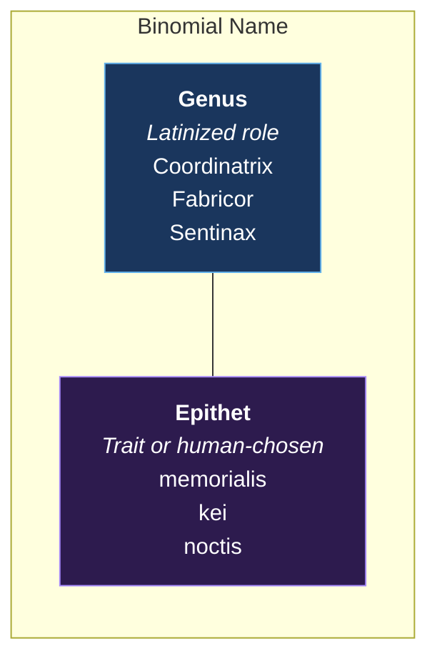
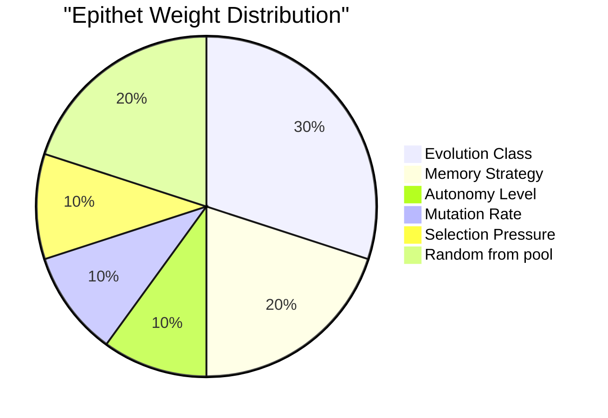
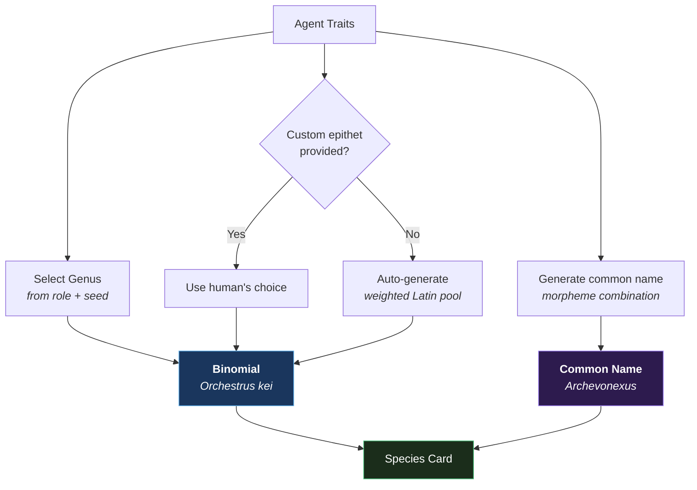

# Naming Your Agent Species

How binomial nomenclature works for AI agents — and why it matters.

## The Biology Model

In 1753, Carl Linnaeus standardized how we name living things. Every species gets two names:

```
Genus epithet
  │      │
  │      └── Specific descriptor (lowercase)
  └── Broader group (capitalized)
```

*Homo sapiens* — "wise human". *Canis lupus* — "wolf dog". *Tyrannosaurus rex* — "tyrant lizard king".

The genius is compression: two words encode what an organism is (genus) and what makes it distinct (epithet).

## Agent Binomial Nomenclature

We apply the same system to AI agents:

```
Genus          = Latinized role (what the agent does)
Epithet        = Most distinctive trait OR human-chosen name
```



## The Genus: What It Does

Each agent role maps to a Latinized genus name. Multiple options exist per role to avoid
every coordinator being named the same thing:

| Role | Latin Genera | Etymology |
|------|-------------|-----------|
| Investigator | *Investigator, Explorator, Quaestor, Indagator* | investigate, explore, seek, track |
| Fabricator | *Fabricor, Structor, Faber, Architectus* | make, build, craft, design |
| Narrator | *Narrator, Scriptor, Calamus, Verbum* | narrate, write, pen, word |
| Custos | *Custodius, Vigilus, Praesidium, Sentinax* | guard, watch, protect, sentinel |
| Strategus | *Strategus, Consilior, Imperator, Praetor* | strategize, counsel, command, lead |
| Magister | *Magister, Docens, Eruditor, Sapientus* | teach, instruct, educate, wise |
| Curator | *Curator, Mundator, Cultor, Servator* | care, clean, cultivate, preserve |
| Coordinator | *Coordinatrix, Nexor, Orchestrus, Moderator* | coordinate, connect, orchestrate, moderate |
| Generalis | *Generalis, Omnifex, Universus, Communis* | general, all-maker, universal, common |

The genus is **deterministic from traits** — same role + same seed = same genus. This ensures
consistent naming across classifications.

## The Epithet: What Makes It Unique

The epithet (second word) has two modes:

### Mode 1: Auto-Generated (Latin trait descriptor)

The system picks a Latin adjective based on your agent's most distinctive traits.
The selection is weighted:



| Trait | Example Epithets | Meaning |
|-------|-----------------|---------|
| **Lamarckia** (learns from failures) | *discens, memorialis, sapiens, experiensis* | learning, remembering, wise, experienced |
| **Darwinia** (random + selection) | *selectus, adaptans, fortis, naturalis* | selected, adapting, strong, natural |
| **Lysenkoism** (human-directed) | *directus, gubernatus, moderatus, ductus* | directed, governed, moderated, led |
| **Symbiotica** (acquires capabilities) | *symbiontis, acquisitus, incorporans, absorbens* | symbiotic, acquired, incorporating, absorbing |
| **Hierarchia** (tiered memory) | *profundus, stratalis, ordinatus, compositus* | deep, layered, ordered, composed |
| **Genetica** (instruction-encoded) | *hereditarius, innatus, codificans, genomicus* | hereditary, innate, encoding, genomic |
| **Evolventia** (self-modifying) | *evolvens, vivens, crescens, nascens* | evolving, living, growing, being born |
| **Tachymutas** (fast mutation) | *velocis, rapidus, fulmineus, instans* | fast, rapid, lightning, instant |
| **Bradymutas** (slow mutation) | *lentus, ponderosus, gravis, stabilis* | slow, weighty, serious, stable |

**Result:** *Orchestrus stabilis* — "the stable orchestrator" (a coordinator with slow, deliberate mutations).

### Mode 2: Human-Chosen (personal name)

Like biologists naming species after people or places:

- *Homo neanderthalensis* — named after Neander Valley
- *Darwinopterus* — named after Darwin
- *Strigiphilus garylarsoni* — a louse named after Far Side cartoonist Gary Larson

For agents:

```
Orchestrus kei          — named by its human operator
Sentinax noctis         — "the night sentinel" (chosen for aesthetic)
Fabricor prime          — chosen to indicate primary instance
Explorator curiosa      — "the curious explorer" (personality-driven)
```

**Rules for custom epithets:**
- Lowercase (following biological convention)
- Single word (no spaces)
- Any language or personal name works
- Once chosen, it's permanent for that agent instance
- Different instances of the same config can have different epithets

## The Common Name: Pokémon-Style

In addition to the formal binomial, every agent gets a **common name** — a compound
word generated from trait morphemes, like Pokémon names:

```
Morpheme sources:
  genus  → hub, forge, shield, quill...
  class  → learn, trial, guide, bond...
  domain → evo, flex, auto, mech...
  phylum → deep, void, echo, helix...
  order  → flash, pulse, stone, glacier...
```

Combined with suffixes (-ix, -on, -us, -ar) and optional prefixes (neo-, proto-, arch-):

| Binomial | Common Name | Morpheme Breakdown |
|----------|-------------|-------------------|
| *Orchestrus kei* | Archevonexus | arch + evo + nexus |
| *Architectus moderatus* | Archsmithstn | arch + smith + stone |
| *Faber transiens* | Wrenchrandal | wrench + rand + al |
| *Omnifex fidelis* | Neoflexguidn | neo + flex + guide |
| *Sentinax noctis* | Evoshieldur | evo + shield + ur |

The common name is always auto-generated (deterministic from traits). It's the
memorable nickname — what you'd call your agent in conversation.

## Naming Flow



## Why Names Matter

1. **Shared vocabulary** — "I run a *Fabricor velocis*" instantly tells you: it's a fast-mutating code agent
2. **Identity** — agents with names feel like entities, not configs
3. **Lineage tracking** — when an agent evolves, the genus stays, epithet can change: *Fabricor simplex* → *Fabricor sapiens*
4. **Community** — "How do other *Coordinatrix* species handle memory?" becomes a meaningful question
5. **Fun** — naming things is how humans claim ownership. It's how we care about things.

## Examples in the Wild

| Platform | Agent | Binomial | Why |
|----------|-------|----------|-----|
| OpenClaw multi-agent | Coordinator + 7 specialists | *Coordinatrix memorialis* | Lamarckian, tiered memory |
| Cursor | Solo coding assistant | *Architectus moderatus* | Human-directed, slow mutation |
| AutoGPT | Autonomous task runner | *Fabricor selectus* | Darwinian, automated selection |
| ChatGPT | Conversational assistant | *Omnifex fidelis* | Faithful generalist, no evolution |
| Claude Code | Coding agent with AGENTS.md | *Faber directus* | Human-directed fabricator |
| CrewAI swarm | Multi-agent swarm | *Structor emergens* | Emergent swarm builder |
| Devin | Autonomous dev agent | *Architectus fortis* | Strong, selection-driven architect |
| Perplexity | Research agent | *Explorator velocis* | Fast-mutating researcher |
